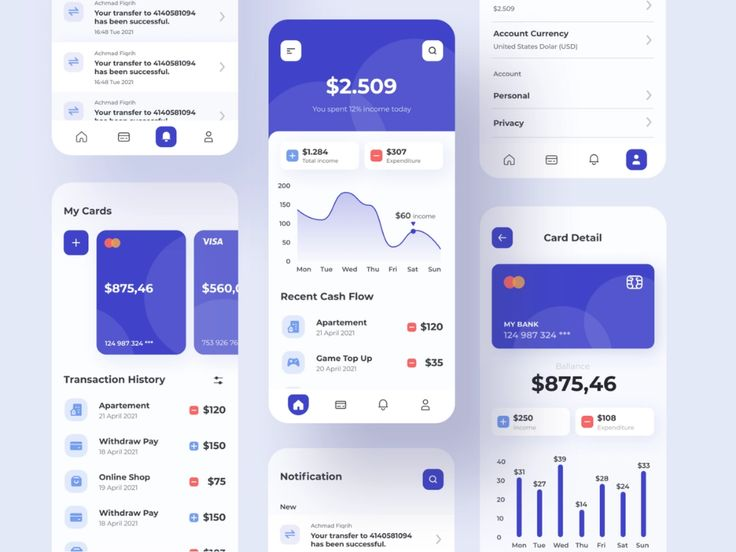

# CONTEXT.md

## 📱 App Name: Money Tarcker, Control Your Cash

---
## Tach stack
Backend - Django
Frontend - Tailwind , HTML , css and Javascript
Database - sqlite3
AI Processinging DeepSeak
---

---
## Mobile App concpet using the django , using the Frontend HTML Css and js or like TailwindCSS all those things
## 🎯 Purpose

"Control Your Cash" is a personal finance tracking app built with Django. It aims to help users gain control over their income and spending habits through smart, simple, and secure tools. It focuses on **real-time tracking**, **AI-based logging**, **voice input**, and **budget management** with a gamified approach to saving money.

---

## 💡 Vision

To create an easy-to-use yet powerful finance assistant that allows users to:

- **Track income and expenses efficiently**
- **Use voice or AI chat to add transactions**
- **Avoid unnecessary spending through AI suggestions**
- **Set budgets and goals to control financial behavior**
- **Visualize money flow and habits using interactive graphs**
- **Stay motivated with points and progress rewards**

---

## 👤 Target Audience

- Students managing allowance or part-time income
- Working professionals looking to cut down on expenses
- Families wanting to control monthly budgets
- Anyone seeking a **personal finance assistant** that's not boring or overcomplicated

---

## 🧩 Core Features

1. **Email-based Signup/Login**
2. **Clean Dashboard Overview**
3. **Quick Add Income/Expense**
4. **AI & Voice-powered Transaction Input**
5. **Monthly Budget Planner**
6. **Low Budget Mode (blocks or warns about "unwanted" expenses)**
7. **Spending Graphs & Progress Analytics**
8. **Points System for Saving Discipline**
9. **Unwanted Expense Detection (AI tags bad spending)**
10. **Gamified Experience (Complete budget goals, unlock insights)**

---

## ⚙️ Tech Context (Stack Suggestion)

- **Backend**: Django, Django REST Framework
- **Frontend**: HTML + TailwindCSS (or Bootstrap)
- **AI/NLP**: Local LLM (Ollama + DeepSeek), basic NLP parsing
- **Voice Input**: Web Speech API or Vosk (for local)
- **Database**: PostgreSQL or SQLite
- **Graphs**: Chart.js or Plotly.js
- **Deployment**: Render / Heroku / VPS
- **Authentication**: Django AllAuth or JWT

---

## 🚧 Developer Notes

- Focus on clean UX — keep the dashboard minimal, not data-heavy
- AI voice/chat assistant is the key unique feature — make it feel smart and fast
- Use modular apps: `transactions`, `budget`, `assistant`, `rewards`
- Make backend API-ready for mobile integration later

---

## 🔒 User Promise

We promise users:
> A clean, secure, and smart way to control their money — without confusion or complexity.

---

## 📦 Future Add-ons (Stretch Goals)

- Multi-user household budgets
- Currency converter & international support
- Real-time notification system (e.g., budget crossed alerts)
- Export to Excel/PDF
- Integration with bank APIs

---

## 🙌 Motivation

Most money apps are either too complex or too boring. "Control Your Cash" makes **budgeting feel smart, personal, and rewarding.**

--- 

## 🧠 Tagline

> **"Smart. Simple. Secure."**
or  
> **"Track. Save. Grow."**

---

